<h1 align="center">Hi! I am Cecilia👋 Full Stack Developer 💻</h1>

## :star: Languages and Tools:

<h3> JavaScript 
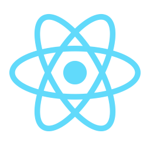 React.js 
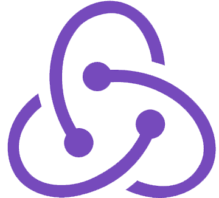 Redux.js
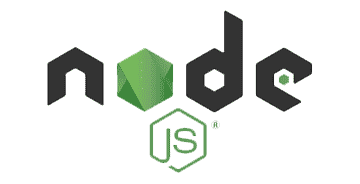 Node.js
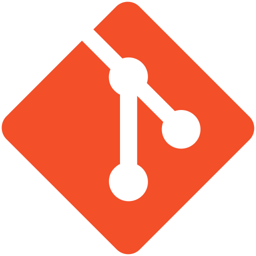 Git
</h3>
<h3>
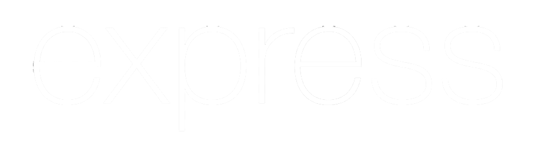 Express.js
 PostgreSQL
 Sequelize
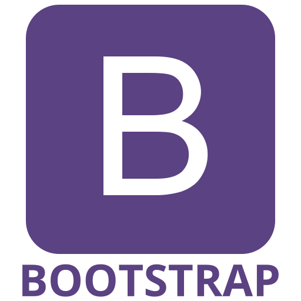 Bootstrap
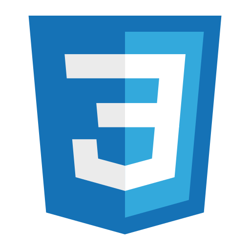 CSS
</h3>

🙋🏻I can contribute a lot as a developer: 
-There are many types of developers in this community, all with very diverse capabilities. I stand out in my problem solving skills. I am very curious and love to learn new things all the time. If I don't know something, I investigate it and I don't stop until I understand it and I can develop it. I have facility to work in a group and whenever I can, I like to help others to achieve their goals, it makes me happy to see the progress of my colleagues.

## :pushpin: My proyects

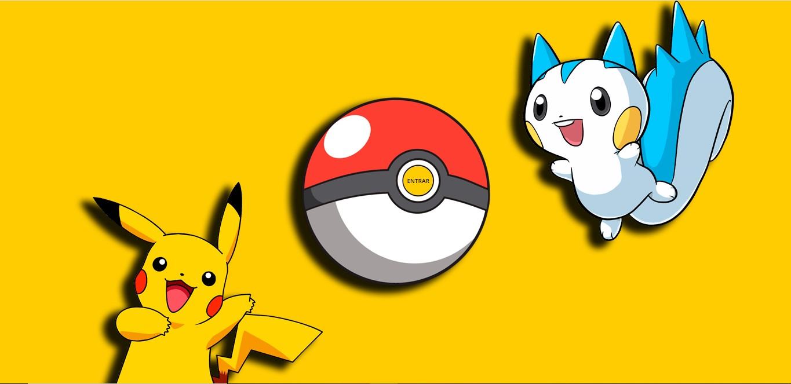
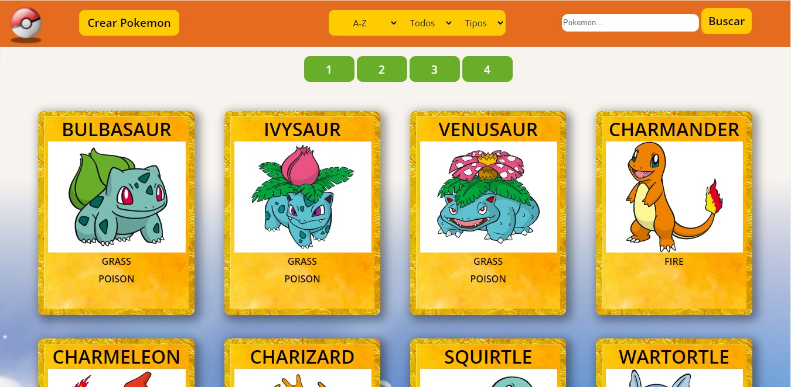
 
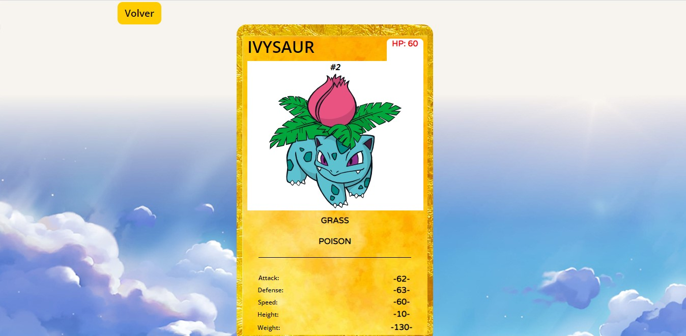
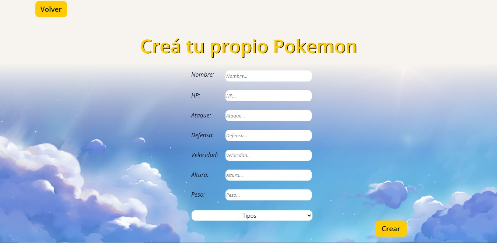
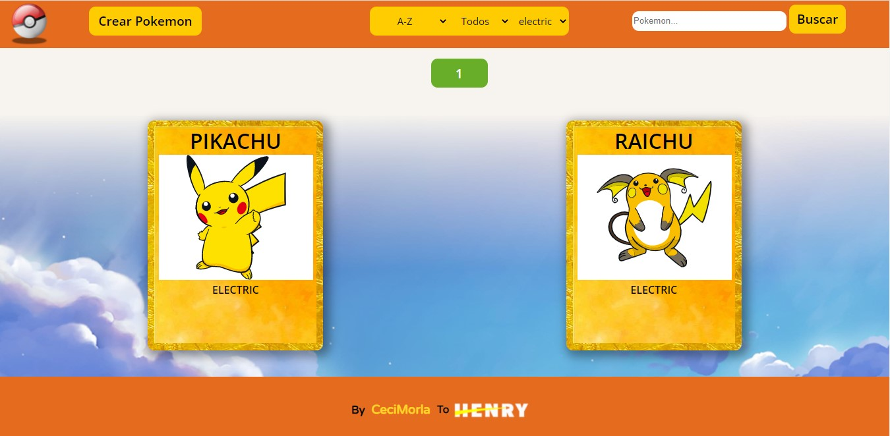

